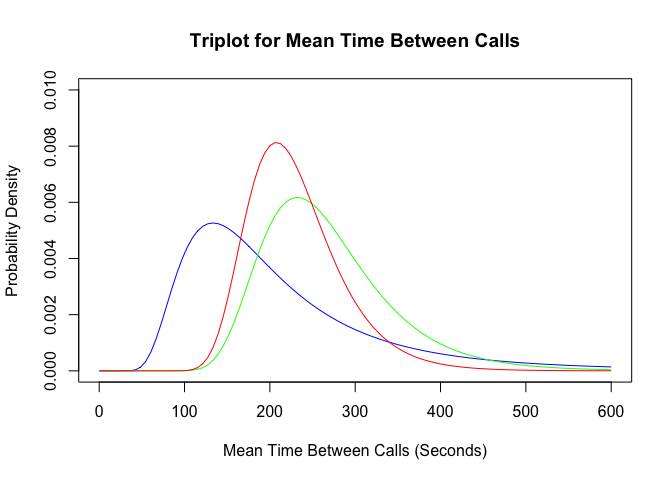
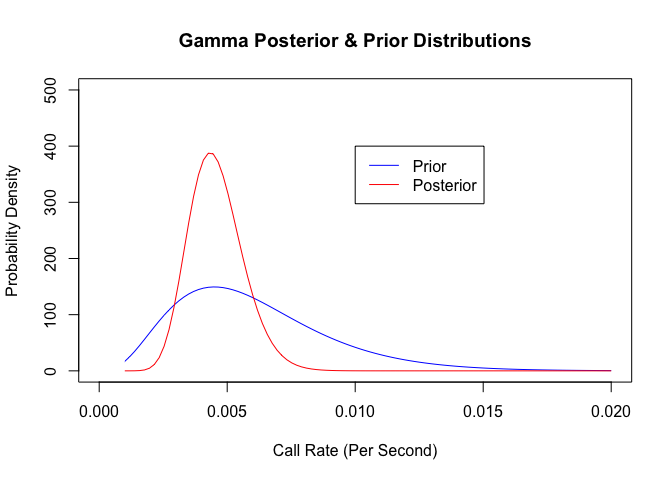
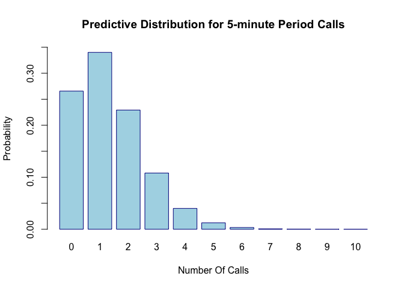
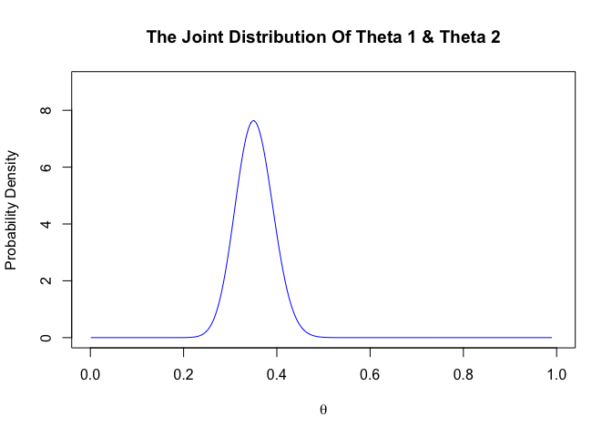
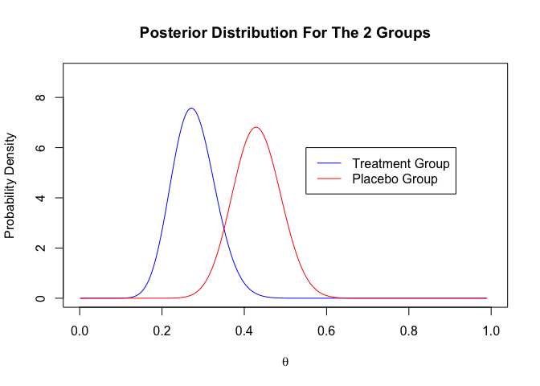

## Problem 1

*Management at a call center is investigating the call load in order to find an efficient staffing policy. Assume that time intervals between calls are exponentially 
distributed. Assume the mean time between calls is constant during the mid-morning period. The following sequence of call times was collected during mid-morning, measured in seconds after the start of data collection: 168, 314, 560, 754, 1215, 1493, 1757, 1820, 1871,1982, 2134, 2430, 3187, 3388, 3485. Assume an inverse Gamma prior distribution with shape a =4 and scale b = 0.0015 for the mean time in seconds between calls Q. Find the posterior distribution for Q. Find the prior and posterior mean and standard deviation for Q. Discuss. (Note: Because of the memoryless property of the exponential distribution, you can treat the time until the first call as having an exponential distribution.)*


a1=shape=a0+n=4+15 = 19
b1=scale=1/(b0^(-1) +sum(x_i)) = 1/(0.0015^(-1)+3485 seconds) = 0.000241


```r
library('invgamma')


CallsBySec <- c(168, 314, 560, 754, 1215, 1493, 1757, 1820, 1871, 
                1982, 2134, 2430, 3187, 3388, 3485)


alpha0 = 4        # Prior shape
beta0 = 0.0015      # Prior inverse-scale (scale of the Gamma distributionf for birth rate)

n = length(CallsBySec) # number of calls
sum.ibt =CallsBySec[n] 
alpha1 = alpha0 + n   # posterior shape
beta1 = (1/beta0 + sum.ibt)^-1

thetavals=seq(length=100,from=0.1,to=600)
prior.dens=dinvgamma(thetavals,alpha0,scale=beta0)
norm.lik=dinvgamma(thetavals,n-1,scale=1/sum.ibt)
post.dens=dinvgamma(thetavals,alpha1,scale=beta1)
plot(thetavals,prior.dens,type="l",col="blue",main="Triplot for Mean Time Between Calls",
     xlab="Mean Time Between Calls (Seconds)",ylab="Probability Density",
     xlim=c(0,600),ylim=c(0,0.01))
lines(thetavals,norm.lik,col="green")
lines(thetavals,post.dens,col="red")
legend(0.01,5.9,c("Prior","Norm Lik","Posterior"),col=c("blue","green","red"),lty=c(1,1,1))
```

<!-- -->

Starting with a very small beta resulted in a very spread out  inverse gamma distribution with mean 222.22 and a large standard deviation of 157.1. Using the exponential data, which is the conjugate pair of the inverse gamma, we updated our beliefs to have a mean of 230 and standard deviation of 55.91. The graph displayed about confirms the findings that the posterior distribution is narrower and and more concentrated.

## Problem 2

*Use the results of Problem 1 to find the posterior distribution
for the mean number of calls per second at the call center during mid-morning. Find 95% credible intervals for the mean number of calls per second and for the mean time between calls. 
Explain your reasoning.*


If the mean time between calls has a inverse gamma distribution (shape = a_star,scale = b_star), then the mean number of calls has a gamma distribution(shape = a_star,scale = b_star), where theta = lambda^-(1)


```r
lambda =  seq(length=100,from=0.001,to=0.02)
prior.dens=dgamma(lambda,shape= alpha0,scale =beta0)
post.dens=dgamma(lambda,shape = alpha1,scale =beta1)
plot(lambda,prior.dens,type="l",col="blue",main="Gamma Posterior & Prior Distributions",
     xlab="Call Rate (Per Second)",ylab="Probability Density",
     xlim=c(0,0.02),ylim=c(0,500))
lines(lambda,post.dens,col="red")
legend(0.01,400,c("Prior","Posterior"),col=c("blue","red"),lty=c(1,1,1))
```

<!-- -->

```r
cat("95% credible intervals for the mean number of calls",qgamma(c(0.025, 0.975),shape = alpha1,scale =beta1))
```

```
## 95% credible intervals for the mean number of calls 0.002755337 0.00685213
```

```r
cat("95% credible intervals for the mean time between calls",qinvgamma(c(0.025, 0.975),shape = alpha1,scale = beta1))
```

```
## 95% credible intervals for the mean time between calls 145.94 362.932
```


Prior Mean = a0 X b0 = 4 X 0.0015 = 0.006 

Prior Standard Deviation = sqrt(a0 X b0^2) = sqrt(4 X 0.0015^2) = 0.003

Posterior Mean = a1 X b1 = 19 X 0.000241 = 0.004579

Posterior Standard Deviation=sqrt(a1 X b1^2) = sqrt(19 X 0.000241^2) = 0.00105

## Problem 3

*What is the posterior predictive distribution for the number 
of calls arriving in a 5-minute period during mid-morning? 
What is the probability that more than 3 calls will arrive 
in any given 5-minute period during mid-morning? Explain your reasoning.*

Since the time between calls has exponential data with an inverse gamma prior and posterior distributions, the number of calls has has poisson data with gamma prior and posterior with negative binomial predictive distribution.
  

```r
y=0:10
NumberPeriods.min = 5
NumberPeriods.sec = NumberPeriods.min*60 # convert 5 mintues to 300 seconds
fpred=dnbinom(y,size=alpha1,prob=1/(1+NumberPeriods.sec*beta1))   # Negative binomial predictive distribution

barplot(fpred,main="Predictive Distribution for 5-minute Period Calls", 
        xlab="Number Of Calls", ylab="Probability", 	col=c("lightblue"), 
        border=c("darkblue"),names.arg=y, beside=TRUE,ylim=c(0,0.35))
```

<!-- -->

```r
(1-sum(fpred[1:4]))*100 # Probability more than 3 calls will arrive
```

```
## [1] 5.687749
```


## Problem 4


*Chronic obstructive pulmonary disease (COPD) is a common lung disease characterized by difficulty in breathing. Its two main forms are chronic bronchitis and emphysema.Most people with COPD have a combination of both these conditions. COPD is a
common cause of visits to emergency medical facilities. A substantial proportion of COPD patients admitted to emergency medical facilities are released as outpatients. A randomized, double-blind, placebo-controlled study examined the incidence of relapse in COPD patients released as outpatients as a function of whether the patients received treatment with corticosteroids.1 A total of 147 patients were enrolled in the study and were randomly assigned to treatment or placebo group on discharge from an emergency facility. Seven patients were lost from the study prior to follow-up. For the remaining
140 patients, the table below summarizes the primary outcome of the study, relapse within 30 days of discharge.*

*Let Y1 and Y2 be the number of patients who relapse in the treatment and placebo groups,
respectively. Assume the Yi are independent random variables with Binomial(70, Qi)
distributions, for i=1,2. Assume Q1 and Q2 are independent with uniform prior
distributions. Find the joint posterior distribution for Q1 and Q2. Plot the posterior
density functions for Q1 and Q2 on the same axes. Comment on your results.*


```r
theta=seq(length=400,from=0.001,to=0.99)

alpha0 = 1
beta0 = 1
priorDens<- dbeta(theta,shape1=alpha0,shape2=beta0)
# The data

y1.repalce = 19    
y1.total = 70    

y1.alpha1 = alpha0 + y1.repalce 
y1.beta1 = beta0 + y1.total - y1.repalce 

postDens.theta1=dbeta(theta,shape1=y1.alpha1,shape2=y1.beta1)  # Posterior

# The data

y2.repalce = 30    
y2.total = 70    

y2.alpha1 = alpha0 + y2.repalce 
y2.beta1 = beta0 + y2.total - y2.repalce 

postDens.theta2=dbeta(theta,shape1=y2.alpha1,shape2=y2.beta1)  # Posterior
joint.Dis<- postDens.theta1*postDens.theta2
# joint distribution plot

plot(theta,joint.Dis,type="l",col="blue",
     main="The Joint Distribution Of Theta 1 & Theta 2",
     xlab=expression(theta),ylab="Probability Density",
     xlim=c(0,1),ylim=c(0,9))
```

<!-- -->

```r
# theta 1 and theta 2 in the same axis
plot(theta,postDens.theta1,type="l",col="blue",
     main="Posterior Distribution For The 2 Groups",
     xlab=expression(theta),ylab="Probability Density",
     xlim=c(0,1),ylim=c(0,9))
lines(theta,postDens.theta2,col="red")
legend(0.55,6,c("Treatment Group","Placebo Group"),col=c("blue","red"),
       lty=c(1,1,1))
```

<!-- -->


## Problem 5
*Generate 1000 random pairs (q1i, q2i), i=1,...,1000 from the joint posterior distribution for (Q1, Q2). Use this random sample to estimate the posterior probability that the rate of
relapse is lower for treatment than for placebo. Comment on your results. Does your analysis support the hypothesis that treatment with corticosteroids reduces the rate of relapse?*

We use the random beta distribution to generate 1000 pairs from theta 1 and theta 2
The first pair is generated from theta 1 (treatment group) with shape1= 20, shape2=52
The second pair is generated from theta 2 (placebo group) with shape1= 31, shape2 = 41


```r
r1<-rbeta(1000,shape1 = 20, shape2 = 52)
r2<-rbeta(1000,shape1 = 31, shape2 = 41)

diff<- r1-r2  #Difference relapce rate

probTreatment = sum(diff<0)/length(diff) #Proportion of treatment is lowerthan placebo

probTreatment
```

```
## [1] 0.969
```


The code above shows that the probability that the relapse rate for the treatment group is lower than the placebo group is 97%. 
This shows strong evidence that the analysis support the hypothesis and we can conclude that the corticosteroids reduces the rate of relapse. 
